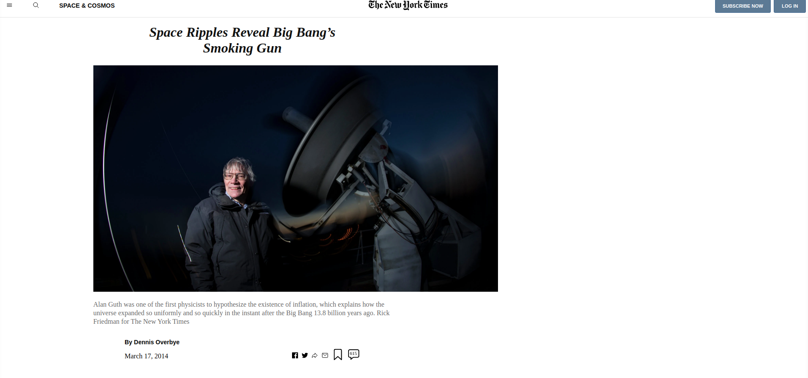

# New York Times Clone - A Microverse Project

A New York Times Article clone.

## Built With

- HTML & CSS

## Live Demo

[Live Demo Link](https://pointerish.github.io/NYT-Clone-Page/)

## Authors

**Josias Alvarado**

- GitHub: [@pointerish](https://github.com/pointerish)
- Twitter: [@pointerish](https://twitter.com/pointerish)
- LinkedIn: [Josias Alvarado](https://www.linkedin.com/in/josias-alvarado-80901878/)

**Che Blanchard**

- GitHub: [@che30](https://github.com/che30)
- Twitter: [@che55085128](https://twitter.com/che55085128 )
- LinkedIn: [Che Blanchard](https://www.linkedin.com/in/che-nsoh-9455271b0/)

##  Contributing

Contributions, issues, and feature requests are welcome!

## Show your support

Give a ⭐️ if you like this project!

## License

This project is [MIT](./LICENSE) licensed.